# Installation Instructions

The obvious part first! Before you consider using this solution, you need to setup an active-directory in the first place, like you would do to use GPMC. I will not provide any documentation how to establish that, because there are many guides out there ;)


## 📦 Installation (Quick Start)

### 1. Extract the zip package
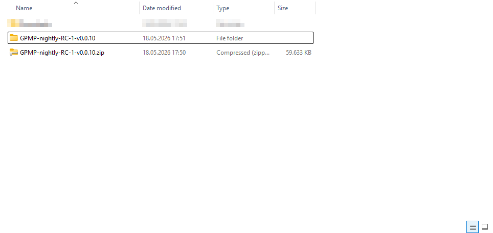


### 2. Install the Application

Run:

```powershell
.\Install-GPMP.ps1 -OpenFirewall -ApplyMigrations -RunInitialSyncOnStartup -InstallPrerequisites
```

This will:
- Install required prerequisites such as RSAT tools and PostgreSQL (Internet connection is needed!)
- Deploy application to C:\Program Files\GpoPortal
- Register Windows Service
- Applies my intended DB schema with 'ApplyMigrations'
- Creates Log directory in C:\ProgramData\GpoPortal
- Optionally trigger initial sync

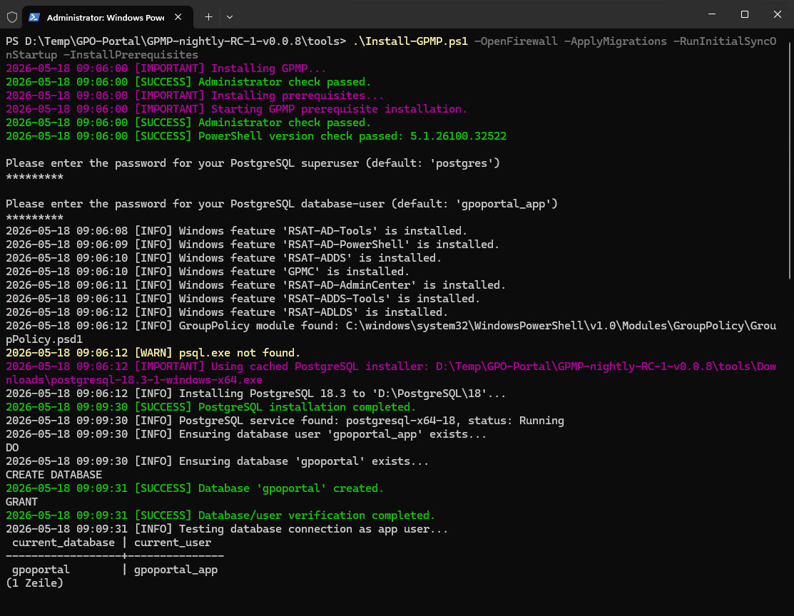<br>
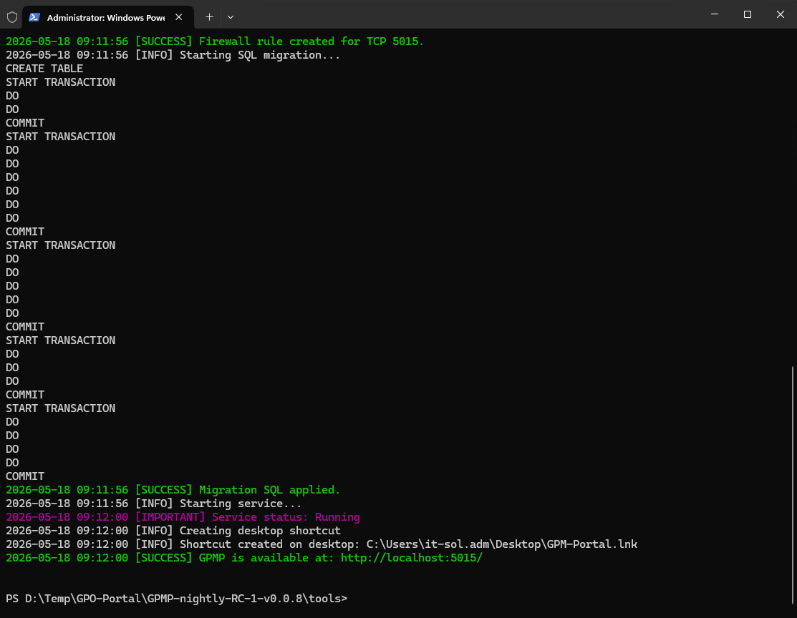<br>

GPMP installation completed successfully.

---

### HTTPS Configuration

GPMP supports both HTTP and HTTPS endpoints.

#### Default Behavior

If HTTPS is enabled during installation and no certificate thumbprint is provided:

- GPMP automatically attempts to locate an existing local certificate
- If no suitable certificate is found:
  - GPMP creates a self-signed certificate
  - HTTPS is enabled automatically
  - Browser certificate warnings may occur

Self-signed certificates are intended for:
- local testing
- lab environments
- proof-of-concept deployments

They are **not recommended for production environments**.

---

### Enable HTTPS (Automatic Self-Signed Certificate)

Run:

```powershell
.\Install-GPMP.ps1 -OpenFirewall -ApplyMigrations -RunInitialSyncOnStartup -InstallPrerequisites -EnableHttps
```

This automatically:
- creates a local HTTPS certificate if needed
- configures Kestrel HTTPS endpoint
- enables secure browser access

> ⚠️ If a self-signed certificate is used, the browser may display a certificate warning until the certificate is trusted manually or replaced with a CA-issued certificate.

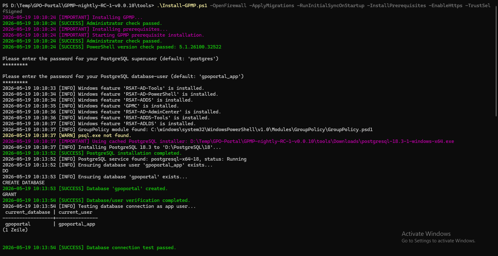<br>
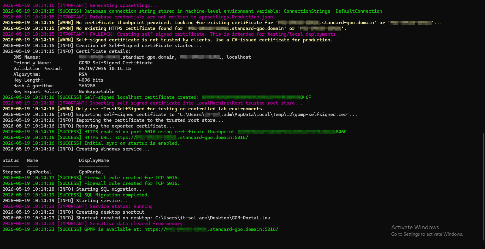<br>

---

### Trust Self-Signed Certificate (Optional)

For testing environments, you can optionally trust the generated self-signed certificate:

```powershell
.\Install-GPMP.ps1 -OpenFirewall -ApplyMigrations -RunInitialSyncOnStartup -InstallPrerequisites -EnableHttps -TrustSelfSigned
```

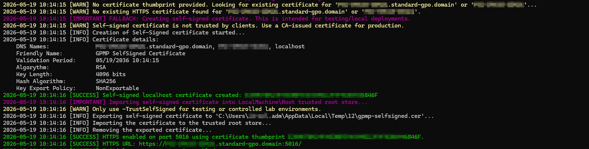<br>

This imports the generated certificate into:

```text
LocalMachine\Root
```

⚠️ **Important:**

Automatically trusting self-signed certificates should only be used in:
- **lab environments**
- **isolated systems**
- **internal testing**

Do not use this approach in enterprise production environments.

---

### Recommended Production Setup

For production environments, use a proper CA-issued certificate:

Examples:
- Internal Active Directory Certificate Services (AD CS)
- Enterprise PKI

Example:

```powershell
.\Install-GPMP.ps1 -OpenFirewall -ApplyMigrations -RunInitialSyncOnStartup -InstallPrerequisites -EnableHttps -CertThumbprint "‎1234567890ABCDEF1234567890ABCDEF12345678"
```

The certificate must:
- exist in `Cert:\LocalMachine\My`
- contain a private key
- match the server hostname/FQDN
- be valid and non-expired

---

## 🌐 Access URLs

HTTP:
```text
http://localhost:5015
```

HTTPS:
```text
https://SERVERNAME:5016
https://FQDN:5016
```

Example:
```text
https://gpmp-server.contoso.local:5016
```

---

<br><br>

### 3. Access UI
You can access GPMP either:
- directly via web browser
HTTP:
```text
http://localhost:5015
```

HTTPS (if enabled):
```text
https://SERVERNAME:5016
https://FQDN:5016
```

- through the automatically created desktop shortcut
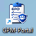 


Authentication:
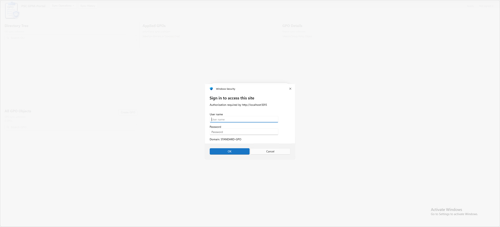<br>


Initial Report-Sync after first logon:
An initial sync is running after the logon. You have to run the 'Report Sync' manually to enable accurate GPO Settings/report-content search. It is recommended but it takes a while depending how much Group Policy Objects you have in your system.  

<br><br>


#### Pre-Release Builds
In **pre-release** builds, the application runs per default in "Read-only mode". This means, you can't make any write operations or any other changes, even if your user have domain-admin priviledges.
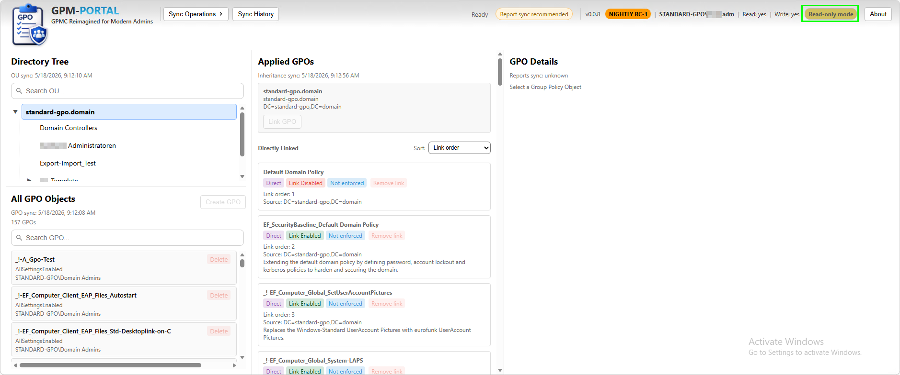<br>

You can change this setting in the applications production configuration file:
```explorer
C:\Program Files\GpoPortal\appsettings.Production.json
```

Find and set with 'Notepad++':
```json
"AllowWriteOperations":  true
```

You need to restart the GPO-Portal service after changing the configration file in order to take effect:
```powershell
Restart-Service GpoPortal
```
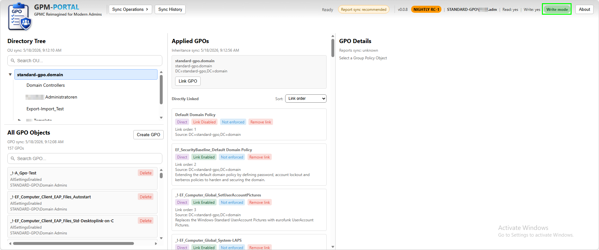<br>


---


## 📦 Uninstallation

Run:

```powershell
.\Uninstall-GPMP.ps1 -RemovePostgreSql
```

This will:
- Stop and remove the GpoPortal Windows service
- Delete installation files
- Remove desktop shortcuts
- Uninstall PostgreSQL and clean up its data directory (if -RemovePostgreSql is specified)

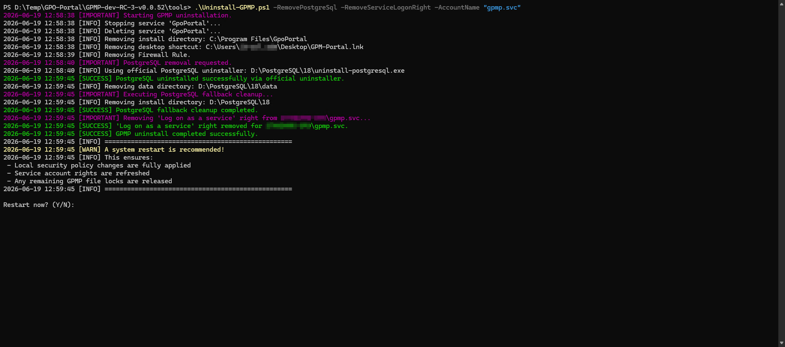

---
