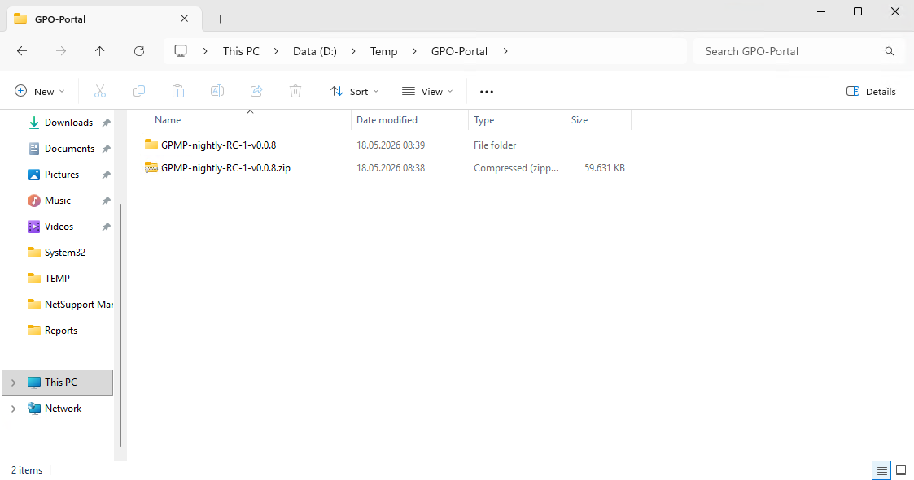

# Installation Instructions

The obvious part first! Before you consider using this solution, you need to setup an active-directory in the first place, like you would do to use GPMC. I will not provide any documentation how to establish that, because there are many guides out there ;)


## 📦 Installation (Quick Start)

### 1. Extract the zip package



### 2. Install the Application

Run:

```powershell
.\Install-GPMP.ps1 -OpenFirewall -ApplyMigrations -RunInitialSyncOnStartup -InstallPrerequisites
```

This will:
- Install all needed prerequisites needed like 'RSAT-Tools' and PostgreSQL (Internet connection is needed!)
- Deploy application to C:\Program Files\GpoPortal
- Register Windows Service
- Applies my intended DB schema with 'ApplyMigrations'
- Creates Log directory in C:\ProgramData\GpoPortal
- Optionally trigger initial sync

<br>
<br>

GPO-Portal is ready now.

<br><br>

### 3. Access UI
You can access the UI direct via the url in your favourite web browser or you execute the created desktop shortcut.
- http://localhost:5015/
-  


Authentication:
<br>


Initial Report-Sync after first logon:
An initial sync is running after the logon. You have to run the 'Report Sync' manually to enable accurate GPO Settings/report-content search. It is recommended but it takes a while depending how much Group Policy Objects you have in your system.  

<br><br>


#### Pre-Release Builds
In **pre-release** builds, the application runs per default in "Read-only mode". This means, you can't make any write operations or any other changes, even if your user have domain-admin priviledges.
<br>

You can change this setting in the applications production configuration file:
```explorer
C:\Program Files\GpoPortal\appsettings.Production.json
```

Find and set with 'Notepad++':
```json
"AllowWriteOperations":  true
```

You need to restart the GPO-Portal service after changing the configration file in order to take effect:
```powershell
Restart-Service GpoPortal
```
<br>


---


## 📦 Uninstallation

Run:

```powershell
.\Uninstall-GPMP.ps1 -RemovePostgreSql
```

This will:
- Stop and remove the GpoPortal Windows service
- Delete installation files
- Remove desktop shortcuts
- Uninstall PostgreSQL and clean up its data directory (if -RemovePostgreSql is specified)


---
