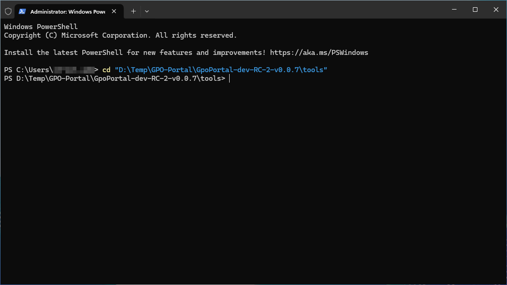
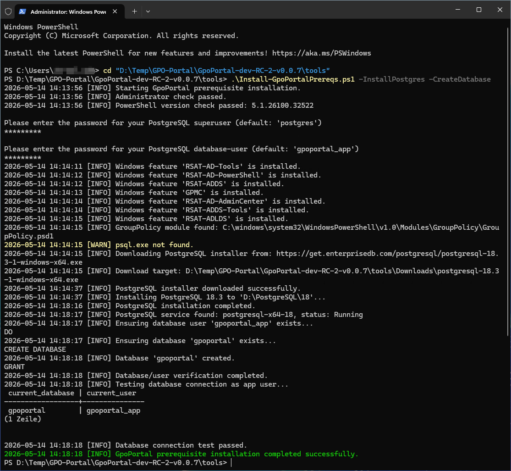
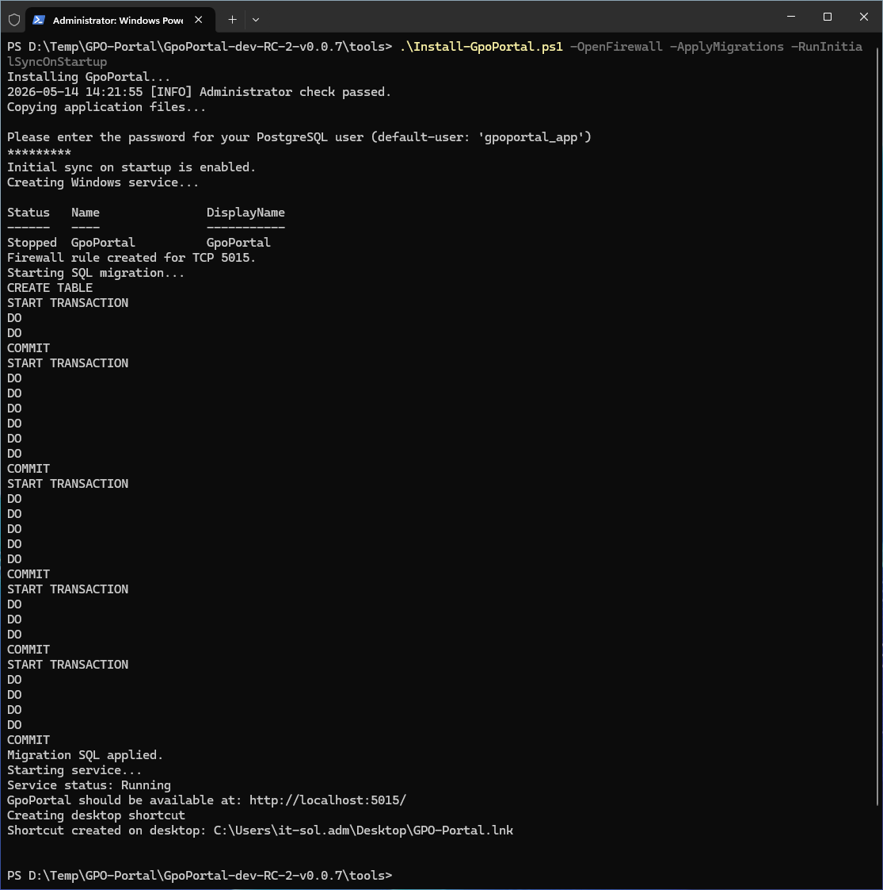
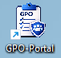
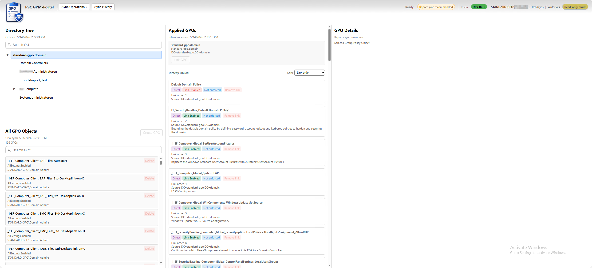
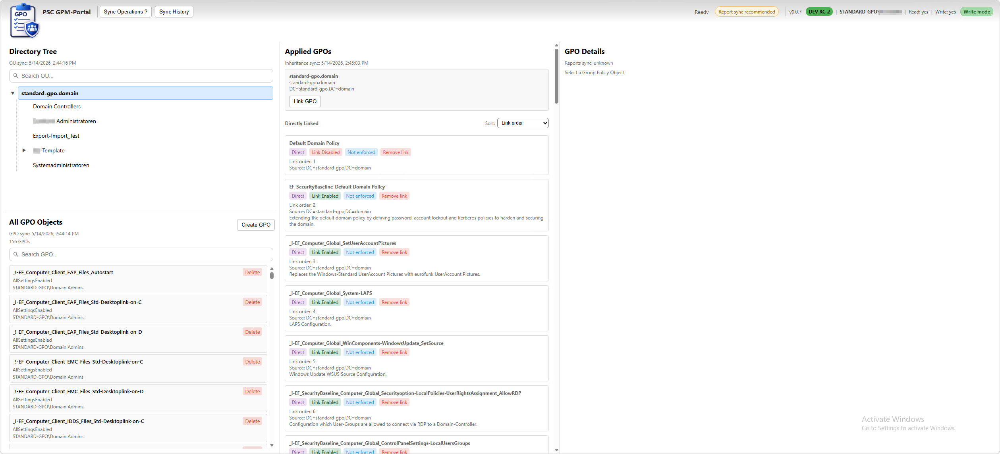
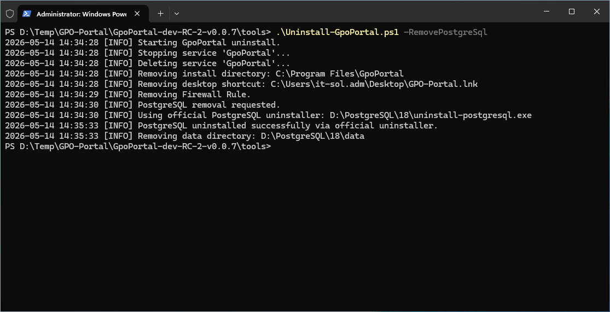

# Production Deployment Considerations

For evaluation environments the default installation is sufficient.

For production deployments it is strongly recommended to use a dedicated Active Directory service account.

Example:

DOMAIN\gpmp.svc

Benefits:

- Proper Active Directory auditing
- Delegated administration
- Predictable write permissions
- Kerberos compatibility
- Enterprise security compliance

The service account should only receive the permissions required for the desired administrative operations.

---

## 🔐 Windows Authentication

GPMP uses Windows Integrated Authentication.

Supported authentication methods:

- Kerberos (preferred)
- NTLM (fallback)

No local user accounts exist within the application.

Authentication is performed directly against Active Directory.

---

## 🌐 Kerberos & SPN Configuration

When hosting GPMP under a dedicated service account, HTTP Service Principal Names (SPNs) may be required.

Example:

setspn -Q HTTP/servername

Typical SPNs:

HTTP/servername
HTTP/servername.domain.local

Without valid SPNs:

- Kerberos authentication may fail
- Browser authentication may fall back to NTLM
- Authorization behavior may become inconsistent

Recent installer versions automatically validate and register required SPNs.

---

## 🔑 Service Account Permissions

For environments using write operations, the service account must have appropriate Active Directory permissions.

Examples:

- Create GPO
- Delete GPO
- Link GPOs
- Modify GPO status
- Modify enforcement state

Required permissions depend on the operations that should be available.

Read-only deployments do not require delegated write permissions.

---

## ⚙️ Log On As A Service

GPMP requires the Windows right:

Log on as a service

Recent installer versions automatically assign this right to the configured service account.

No manual Local Security Policy configuration should be required.

---

## 🔍 Startup Validation

During application startup, GPMP validates critical configuration values.

Examples include:

- Service identity
- Authentication configuration
- Authorization configuration
- PowerShell script configuration
- Operational mode

Validation results are written to:

C:\ProgramData\GpoPortal\Logs\

---

<br>

# Installation Instructions

The obvious part first! Before you consider using this solution, you need to setup an active-directory in the first place, like you would do to use GPMC. I will not provide any documentation how to establish that, because tehre are many guides out there ;)


## 📦 Installation (Quick Start)

### 1. Extract the zip package


### 2. Prerequisites Installation

Open PowerShell with administrative rights and go into the this directory.

```powershell
cd "D:\Temp\GPO-Portal\GPMP-dev-RC-2-v0.0.9\tools"
```




#### Installation of the database (Internet Connection required!)
Run:

```powershell
.\Install-GPMP-Prereqs.ps1 -InstallPostgres -CreateDatabase
```

This will:
- Install required RSAT features
- Download and install PostgreSQL with dependencies
- Create database & user
- Validate connectivity

<br><br>

If you don't have an internet connection, you have to provide the postgresql installer file. e.g.:
```powershell
.\Install-GPMP-Prereqs.ps1 -InstallPostgres -CreateDatabase -PostgresInstallerPath ".\tools\postgresql-installer.exe" 
```
<br>

### 2. Install the Application

Run:

```powershell
.\Install-GPMP.ps1 -OpenFirewall -ApplyMigrations -RunInitialSyncOnStartup -InstallPrerequisites
```

This will:
- Deploy application to C:\Program Files\GpoPortal
- Register Windows Service
- Apply DB schema
- Creates Log directory in C:\ProgramData\GpoPortal
- Optionally trigger initial sync

<br>

GPO-Portal is ready now.

<br><br>

### 3. Access UI
You can access the UI direct via the url in your favourite web browser or you execute the created desktop shortcut.
- http://localhost:5015/
-  


Authentication:
<br>


Initial Report-Sync after first logon:
An initial sync is running after the logon. You have to run the 'Report Sync' manually to enable accurate GPO Settings/report-content search. It is recommended but it takes a while depending how much Group Policy Objects you have in your system.  

<br><br>


#### DEV MODE
In developer builds, the application runs per default in "Read-only mode". This means, you can't make any write operations or any other changes.
<br>

You can change this setting in the applications production configuration file:
```explorer
C:\Program Files\GpoPortal\appsettings.Production.json
```

Find and set with 'Notepad++':
```json
"AllowWriteOperations":  true
```

You need to restart the gpo-portal service after changing the configration file in order to take effect:
```powershell
Restart-Service GpoPortal
```
<br>


---


## 📦 Uninstallation

Run:

```powershell
.\Uninstall-GPMP.ps1 -RemovePostgreSql
```

This will:
- Stop and remove the GpoPortal Windows service
- Delete installation files
- Remove desktop shortcuts
- Uninstall PostgreSQL and clean up its data directory (if -RemovePostgreSql is specified)



---

## 🚨 Troubleshooting

### Authentication Fails

Verify:

- Browser Integrated Authentication settings
- Service status
- SPN registration

### Access Denied During Write Operations

Verify:

- Service account permissions
- Group Policy delegation
- Write authorization groups

### Service Will Not Start

Verify:

- Service account credentials
- Log on as a service rights
- Configuration files


