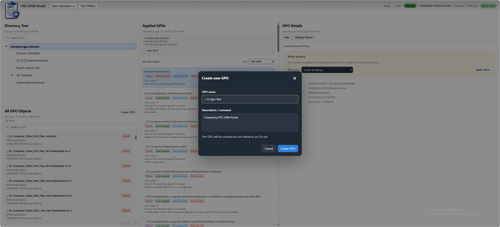
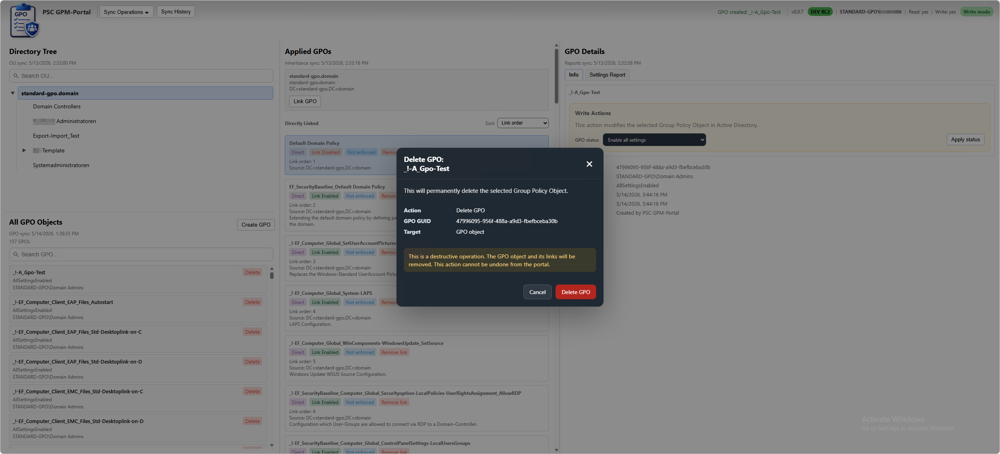
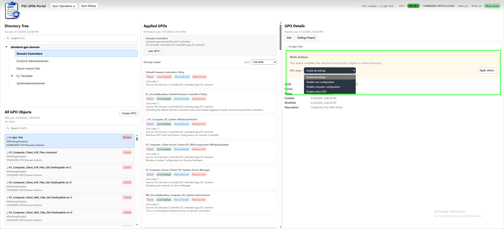
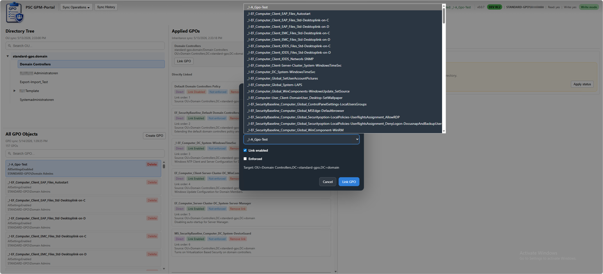
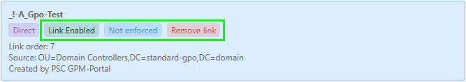
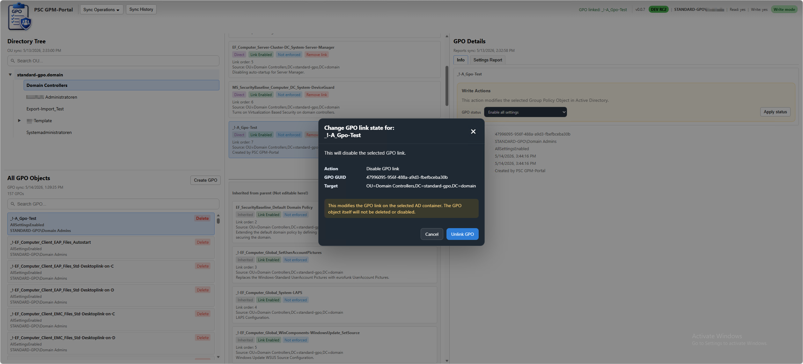
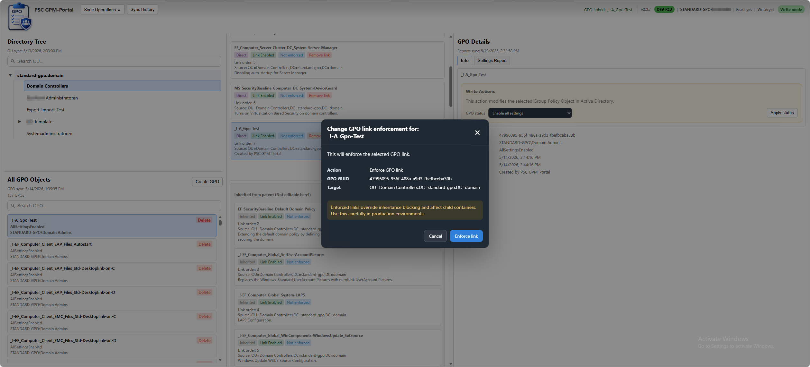
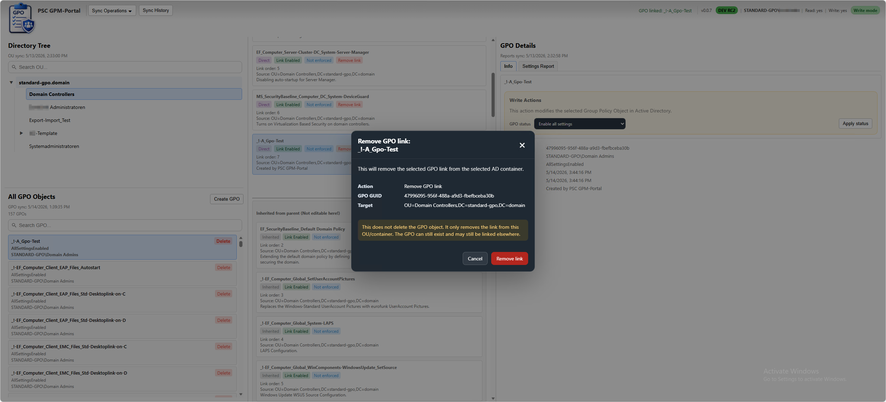

# GPMP Release Comparison

This document provides an overview of the feature evolution and architectural improvements between the public GPMP release generations.

---

## 📈 Release Comparison

| Feature | DEV RC1 | Nightly RC1 |
|---|---|---|
| OU Tree Visualization | ✅ | ✅ |
| GPO Object Search | ✅ | ✅ |
| GPO HTML Report Rendering | ✅ | ✅ |
| Inheritance Visualization | ✅ | ✅ |
| Windows Authentication | ✅ | ✅ |
| RID-based Authorization | ✅ | ✅ |
| Initial Startup Sync | ✅ | ✅ |
| Sync History | ✅ | ✅ |
| PostgreSQL Backend | ✅ | ✅ |
| Windows Service Support | ✅ | ✅ |
| Self-contained Deployment | ✅ | ✅ |
| GPO Status Changes | ❌ | ✅ |
| Create GPO Workflow | ❌ | ✅ |
| Delete GPO Workflow | ❌ | ✅ |
| Link GPO to OU | ❌ | ✅ |
| Remove GPO Links | ❌ | ✅ |
| GPO Link Enable / Disable | ❌ | ✅ |
| GPO Enforcement Toggle | ❌ | ✅ |
| Interactive Badge Actions | ❌ | ✅ |
| Modal-based Write Operations | ❌ | ✅ |
| Keyboard-aware Modal UX | ❌ | ✅ |
| Real-time UI Updates | ❌ | ✅ |
| Live Cache Synchronization | ❌ | ✅ |
| Write-aware UI Controls | ❌ | ✅ |
| Confirmation Dialogs | ❌ | ✅ |
| Controlled Write Architecture | ❌ | ✅ |
| Dynamic Badge State Refresh | ❌ | ✅ |
| Interactive Link Management | ❌ | ✅ |
| Split Stylesheet Architecture | ❌ | ✅ |
| Optimistic UI Refresh Strategy | ❌ | ✅ |
| Advanced Write UX | ❌ | ✅ |
| Cached Metadata Updates After Writes | ❌ | ✅ |

---

## 🆕 Major Additions in Nightly

**Nightly RC1** introduces the first interactive write operations for GPMP.

The platform evolves from a visualization-focused portal into a browser-based operational management platform for Microsoft Group Policy environments.

---

## 🧩 New Write Operations

### GPO Object Management

#### Create new GPOs

  

#### Delete existing GPOs

  

#### Change GPO Status

Supported states:

- All settings enabled
- User configuration disabled
- Computer configuration disabled
- Entire GPO disabled

  

---

### GPO Link Management

#### Link GPOs to OUs

  

#### Interactive Quick-Action Badges

  

#### Enable / Disable GPO Links

  

#### Enforce / Remove Enforcement

  

#### Remove GPO Links from OUs

  

#### Live UI Synchronization

After write operations, the interface updates immediately without requiring manual reloads.

---

## 🖥️ Modernized Operational Workflow

**Nightly RC1** introduces a significantly more modern operational workflow inspired by contemporary web administration platforms.

Implemented improvements include:

- modal-based write dialogs
- interactive badge operations
- keyboard-aware workflows
- context-sensitive controls
- live inheritance updates
- dynamic UI refresh behavior
- write-aware interface rendering
- operational state visibility

The platform now behaves more like a modern operational management system rather than a static administration console.

---

## ⚡ UI & UX Improvements

**Nightly RC1** introduces:

- real-time badge updates
- live inheritance refresh
- dynamic write-state rendering
- context-sensitive operations
- improved action visibility
- interactive modal workflows
- cleaner operational separation

---

## 🧠 Architectural Improvements

## Cache Synchronization

**Nightly RC1** introduces live cache synchronization after write operations.

Affected objects are updated immediately after successful operations to keep the UI synchronized with Active Directory state.

---

### Operational Separation

The platform now clearly separates:

- GPO object state
- GPO link state
- inheritance behavior
- authorization capability
- operational visibility

This separation improves operational clarity and reduces ambiguity.

---

### Stylesheet Architecture

The frontend styling was split into focused stylesheet components:

| File | Purpose |
|---|---|
| `stylesheet_main.css` | Core layout, panels and report rendering |
| `stylesheet_toolbar.css` | Toolbar, sync state and authorization display |
| `stylesheet_modal.css` | Modal dialogs and write workflows |
| `stylesheet_misc.css` | Utility classes, badges and reusable UI elements |

---

## 📘 Important Terminology

GPMP differentiates between several operational concepts:

| Type | Meaning |
|---|---|
| GPO Status | Object-level configuration state |
| GPO Link State | Whether a GPO is linked to a container |
| Enforcement | Whether inheritance blocking is overridden |
| Link Scope | Whether a link is direct or inherited |

This separation mirrors native Microsoft Group Policy behavior.

---

## 🧩 Core Features Available Since DEV RC1

### Read Operations

- Active Directory OU tree visualization
- GPO object browsing
- inheritance visualization
- HTML report rendering
- full-text GPO search
- search highlighting
- link state visibility

---

### Security & Authorization

- Windows Authentication
- Kerberos / NTLM support
- RID-based authorization
- read/write separation
- global write protection

---

### Backend Platform

- ASP.NET Core (.NET 10)
- PostgreSQL
- Entity Framework Core
- PowerShell integration

---

### Synchronization Features

- manual synchronization
- startup synchronization
- sync history tracking
- report synchronization

---

### Deployment Features

- self-contained publishing
- Windows Service support
- automated prerequisite installation
- PostgreSQL integration
- deployment scripting
