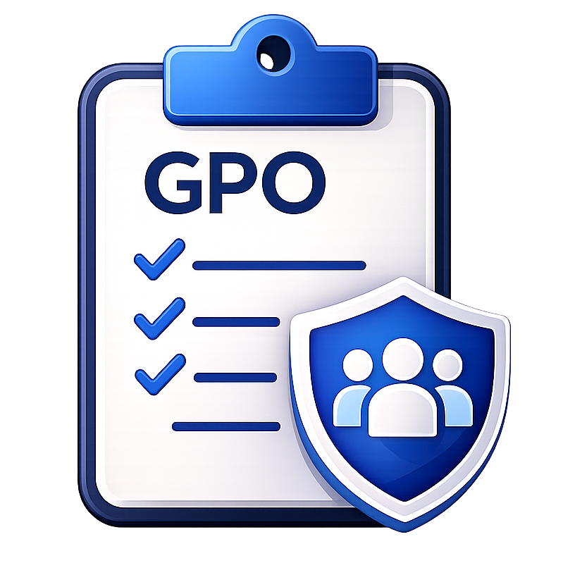
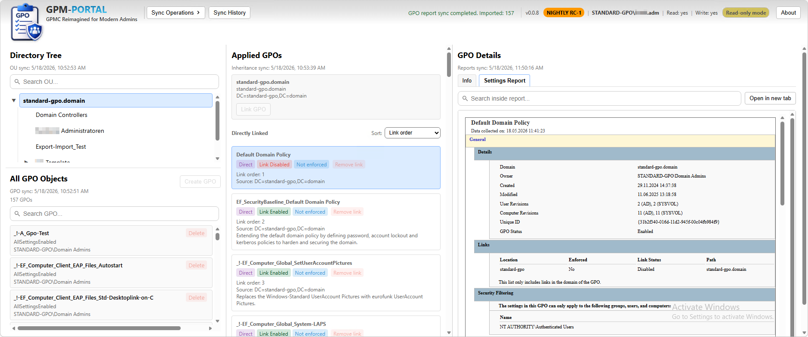

# Group Policy Management Portal


<br>

> A modern, lightweight reimagining of the Group Policy Management Console (GPMC)  
> built for clarity, speed, and real-world administrative workflows.

---

<br>

## 🚀 Overview

**GPMP (Group Policy Management Portal)** is a modern web-based management platform for Microsoft Group Policy environments.

It modernizes classic Group Policy administration by replacing legacy MMC-based workflows with a fast, interactive and browser-based experience, while still fully relying on Microsoft's native Group Policy infrastructure.

<br>


GPMP provides:

- Modern browser-based administration
- Interactive OU and inheritance visualization
- Full-text Group Policy search
- Real-time UI synchronization
- Controlled live write operations
- RID-based authorization
- Safe-by-default operational workflows
- PowerShell-driven integration with Active Directory
- Centralized cache-driven architecture

---

## 🛠️ Project Status

GPMP is currently in active development.

The current NIGHTLY builds already support:

- controlled live write operations
- interactive inheritance management
- reusable modal-driven workflows
- enterprise-oriented authorization concepts
- live synchronization architecture
- browser-based operational management

The project is evolving toward a modern operational platform for enterprise Group Policy management.

---

<br>

# ✨ Current Features

<br>

## Read Operations

- Browse Active Directory OU structures
- View directly linked and inherited GPOs
- Render native GPO HTML reports
- Full-text search across GPOs
- View inheritance and enforcement state
- Live link state visibility
- Search highlighting and match detection

<br>

## Write Operations (Only in 'Write-Mode')

- Change GPO status
- Create new GPOs
- Delete existing GPOs
- Link GPOs to OUs
- Remove GPO links
- Enable / disable links
- Enforce / remove enforcement
- Live cache synchronization after changes

<br>

## Platform Features

- ASP.NET Core (.NET 10)
- PostgreSQL backend
- Windows Authentication (Negotiate / Kerberos / NTLM)
- RID-based authorization
- Self-contained deployment support
- PowerShell integration
- Startup synchronization
- Sync history tracking
- Modal-driven operational workflows
- Split stylesheet architecture
- Publish-ready release packaging

---

<br>

# ❔ Why GPMP?

Classic GPMC is powerful, but operationally outdated.

GPMP modernizes Group Policy management through:

- browser-based administration
- live operational workflows
- interactive inheritance visibility
- modern UI/UX concepts
- centralized metadata architecture
- controlled write operations

without replacing the underlying Microsoft Group Policy infrastructure.

---

<br>

# ⚖️ GPMP vs Classic GPMC

| Capability | Classic GPMC | GPMP |
|---|---|---|
| MMC-based UI | ✅ | ❌ |
| Modern Web UI | ❌ | ✅ |
| Browser-based Administration | ❌ | ✅ |
| Interactive Inheritance Visualization | ⚠️ Limited | ✅ |
| Full-text GPO Search | ❌ | ✅ |
| Real-time UI Updates | ❌ | ✅ |
| Live Write Operations | ⚠️ Legacy Workflow | ✅ |
| Modal-driven Operations | ❌ | ✅ |
| Cached Metadata Architecture | ❌ | ✅ |
| Instant Link State Visibility | ❌ | ✅ |
| Interactive Badge Actions | ❌ | ✅ |
| Separation of Object / Link / Inheritance State | ⚠️ Partial | ✅ |
| Modern UX Concepts | ❌ | ✅ |

---

<br>

### 📦 Release Information

| Channel | Purpose |
|---|---|
| NIGHTLY | Public preview builds with newest features |
| STABLE | Recommended production-ready releases |

Current public release:

```text
v0.0.8-nightly-RC1
```

<br>

#### Channels

Channels provide a first identification of the current state. There exists 3 channels so far:

1.  - Development Builds
2.  - First test builds
3.  - A final release

<br>

### ⚠️ Disclaimer

GPMP performs live Active Directory Group Policy operations.

Although multiple safety mechanisms and confirmation workflows are implemented ('Read-Only-Mode' per default is set!), this software is still considered pre-release software at least it is not declared with the  badge.

Always test in a non-production environment before deploying into critical infrastructure.

---

<br>

## 📚 Documentation

| Document | Description |
|---|---|
| [RELEASE-COMPARISON.md](Docs/Release-Comparison.md) | DEV RC1 vs. NIGHTLY RC1 feature comparison |
| [INSTALLATION.md](Docs/INSTALLATION.md) | Full installation, deployment and removal/cleanup guide |
| [CONFIGURATION.md](Docs/Application-Configuration.md) | Application configuration reference |
| [ARCHITECTURE.md](Docs/ARCHITECTURE.md) | Internal architecture and system design |
| [AUTHORIZATION.md](Docs/Authorization.md) | RID-based authorization model |
| [ROADMAP.md](Docs/ROADMAP.md) | Planned features and future direction |
| [Logging.md](Docs/LOGGING.md) | Application logging information |

---

<br>

## 🧠 Final Note

GPMP aims to modernize Group Policy management through:
- browser-based administration
- interactive operational workflows
- safer change visibility
- modern UI/UX concepts
- automation-friendly architecture

without replacing Microsoft’s underlying Group Policy infrastructure.


---

<br>

## 👤 Author

**Author:** Patrick Scherling  
**Contact:** @Patrick Scherling  

---

> ⚡ *“Automate. Standardize. Simplify.”*  
> Part of Patrick Scherling’s IT automation suite for modern Windows Server infrastructure management.
