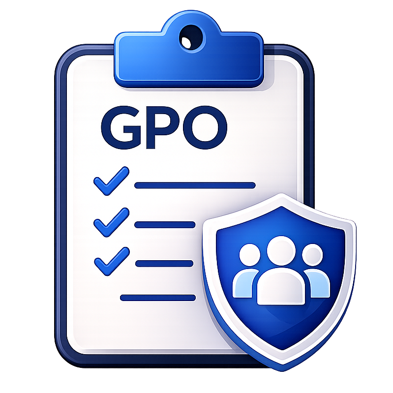
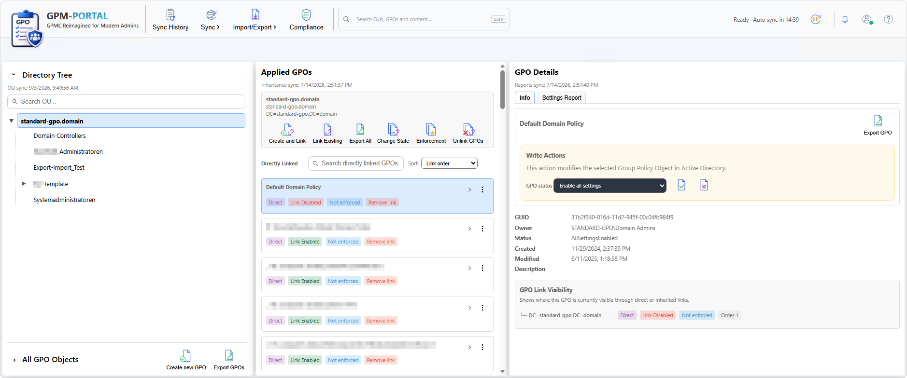

# Group Policy Management Portal

 

> GPMP provides centralized Group Policy governance,
> security-baseline compliance and audit-ready evidence for Microsoft Active Directory environments. 

---

 

## 🚀 Overview

**GPMP (Group Policy Management Portal)** is a self-hosted Group Policy governance and compliance platform for Microsoft Active Directory environments.

GPMP adds a centralized operational and analytical layer on top of Microsoft’s native Group Policy infrastructure. Active Directory and SYSVOL remain authoritative, while GPMP provides synchronized visibility, controlled administration, security-baseline evaluation, governed exceptions, and audit-ready evidence through a browser-based interface.

Unlike general identity-management suites, GPMP does not attempt to manage the complete identity lifecycle. It focuses specifically on helping infrastructure administrators, security teams, consultants, and auditors understand what their Group Policies do, determine where they apply, validate them against security baselines, and document deviations.

 

---

 

## 📚 Documentation

| Document | Description |
|---|---|
| [DOCUMENTATION](https://gpmp.atlassian.net/wiki/x/AoAg) | Online Documentation |
| [INSTALLATION](https://gpmp.atlassian.net/wiki/external/NTRiNDVlYjk3MmY4NDJkODg4NmJiOTUyMTQ3ZjU4MTA) | Full installation, deployment and removal/cleanup guide |
| [CONFIGURATION](https://gpmp.atlassian.net/wiki/external/Njc5YzhiMjU3ZGNjNGZhMWE1NWNkMmZjMGIxYTk4Mzk) | Application configuration |
| [ARCHITECTURE](https://gpmp.atlassian.net/wiki/external/Y2IyOTMwMzgxNTYyNDdhMmE3YTBlNGFjZTRiY2ViZjQ) | Internal architecture and system design |
| [AUTH](https://gpmp.atlassian.net/wiki/external/YjNmZGE0MDNjYmZlNGMyM2I3YmM3ZjAwNWIzNzNlODY) | Authentication & Authorization |
| [ROADMAP](https://gpmp.atlassian.net/wiki/external/ZDNiMjkwYjI0MWY2NDE0YWIxYzNjZTA3ZWM4Mzg0ZjQ) | Planned features and future direction |
| [LOGGING](https://gpmp.atlassian.net/wiki/external/MWQzOWFiNjQ4M2VlNDY2MjkxYjNkODQ5NWZmMjk1ZGM) | Application logging information |

---

 

## 👤 Author

**Author:** Patrick Scherling  
**Contact:** @Patrick Scherling  

---

> ⚡ *“Automate. Standardize. Simplify.”*  
> Part of Patrick Scherling’s IT automation suite for modern Windows Server infrastructure management.
